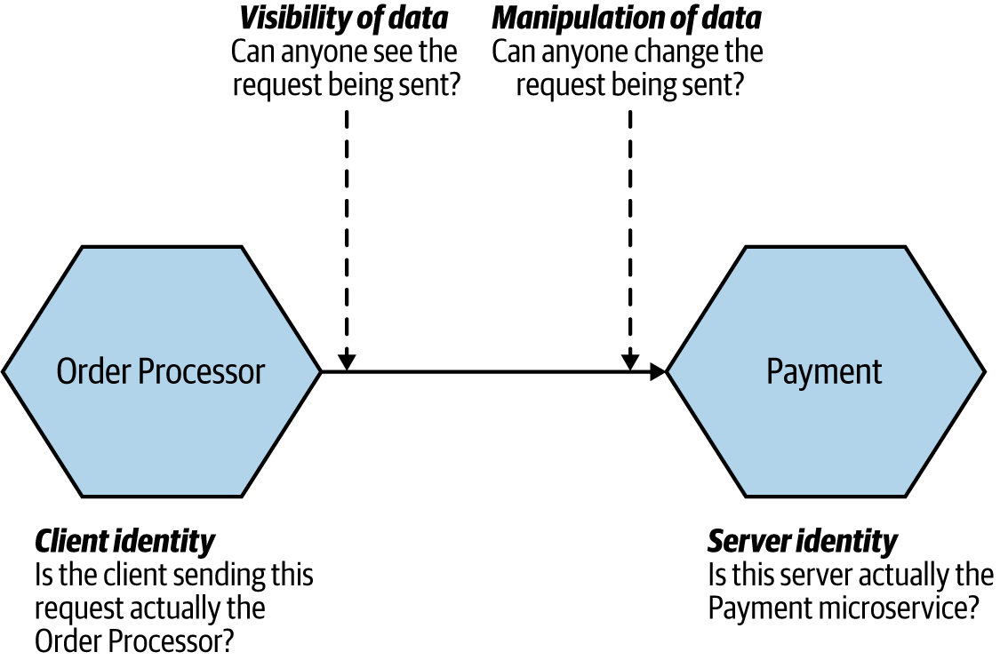

# Mutual TLS and Spring Boot
This project aims to implement a solution for **secure data transit between client and server** via **mutual TLS**.  
There are four goals to achieve:
1. Server identity
2. Client identity
3. Manipulation of data
4. Visibility of data  

## Requirements
- Imagine there is two microservices which want to communicate with each other in a trusted communication base.  
- Order Processor aims to send a request to the Payment service.
- It's vital for Payment Service to trust the clients which aim to send a request.
- And also it is important for Order Processor to trust the Payment service.
- It's obvious that we do not want that while the data is being sent, someone read or manipulate it.   

In this figure, we can see the four concerns of data transit for the specific software design.




## Solution: HTTPS Everywhere!
1. Server identity: we follow th best practice of TLS and particularly in our case enabling HTTPS on the server.  
2. Client identity: we can do this through the use of _mutual TLS_, in which case both the client and server make use of certificates.  
3. Visibility of data: When you use either plain old HTTPS or mutual TLS, data won’t be visible to intermediate parties—this is because TLS encrypts the data being sent.  
4. Manipulation of data: Typically, the types of protections that make data invisible will also ensure that the data can’t be manipulated (HTTPS does that, for instance).

## Solution Implementation
Now it's the time to get your hand a little dirty with codes!

### Enabling HTTPS on the server
The first step is to generate a key store includes private and public key.
```shell
$ keytool -v -genkeypair -keystore https-server/src/main/resources/server-identity.jks -storepass password -keypass password -keyalg RSA -keysize 2048 -alias https-server -validity 3650 -deststoretype pkcs12 -ext KeyUsage=digitalSignature,dataEncipherment,keyEncipherment,keyAgreement -ext ExtendedKeyUsage=serverAuth,clientAuth -ext SubjectAlternativeName:c=DNS:localhost,DNS:raspberrypi.local,IP:127.0.0.1
```
Then it's the time to enable https on spring boot adding these lines to the ``application.properties``
```properties
server.ssl.enabled=true
server.ssl.key-store=classpath:server-identity.jks
server.ssl.key-password=password
server.ssl.key-store-password=password
```
Congratulations! You enabled TLS-encrypted connection!

### Send HTTPS request to the server
#### Export certificate of the server key store
```shell
$ keytool -v -exportcert -file https-server/src/main/resources/https-server-cert.cer -alias https-server -keystore https-server/src/main/resources/server-identity.jks -storepass password -rfc
```
#### Create Trust Store for the client
```shell
$ keytool -v -importcert -file https-server/src/main/resources/https-server-cert.cer -alias https-server -keystore https-client/src/main/resources/truststore.jks -storepass password -noprompt
```
**IMPORTANT: clean your project and rebuild it**  
because the client reads the truststore.jks from classpath and sometime it will not be updated.

### Mutual TLS
add this config to the server ``application.properties``
```properties
server.ssl.client-auth=need
```
Now if you run the client you will get this error:
```text
javax.net.ssl.SSLHandshakeException: Received fatal alert: bad_certificate
```
Hence, you need to create client keystore to have an identity
```shell
$ keytool -v -genkeypair -dname "CN=Suleyman,OU=Altindag,O=Altindag,C=NL" -keystore https-client/src/main/resources/client-identity.jks -storepass secret -keypass secret -keyalg RSA -keysize 2048 -alias client -validity 3650 -deststoretype pkcs12 -ext KeyUsage=digitalSignature,dataEncipherment,keyEncipherment,keyAgreement -ext ExtendedKeyUsage=serverAuth,clientAuth
```
Then it's needed to export certificate of the client identity
```shell
$ keytool -v -exportcert -file https-client/src/main/resources/https-client-cert.cer -alias client -keystore https-client/src/main/resources/client-identity.jks -storepass secret -rfc
```
Finally, you should create the server truststore with the certificate of the client
```shell
$ keytool -v -importcert -file https-client/src/main/resources/https-client-cert.cer -alias client -keystore https-server/src/main/resources/truststore.jks -storepass secret -noprompt
```
Now we have a trust store for the server so let's identify the trust store for the server by adding these configs to the server application.properties
```properties
server.ssl.trust-store=classpath:truststore.jks
server.ssl.trust-store-password=secret
```

### Java Code
How to config SSL context for the client?
```java
SSLContext sslContext = new SSLContextBuilder()
                .loadTrustMaterial(new ClassPathResource(properties.getTrustStore()).getFile(), properties.getTrustStorePassword())
                .loadKeyMaterial(new ClassPathResource(properties.getKeyStore()).getFile(), properties.getKeyStorePassword(), properties.getKeyPassword())
                .setProtocol("TLSv1.3")
                .build();
```
How to config RestTemplate with provided SSLContext?
```java
RestTemplate restTemplate = new RestTemplate();
        restTemplate.setRequestFactory(
                new HttpComponentsClientHttpRequestFactory(
                        HttpClientBuilder.create()
                                .setSSLContext(sslContext)
                                .build()
                )
        );
```
